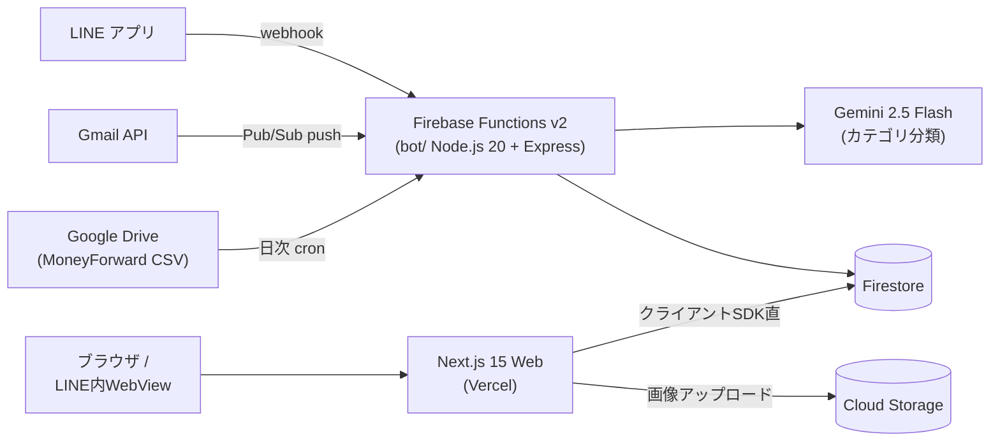

# 📱 LINE家計簿（ぶちこむ家計簿）

[](https://github.com/Makoto041/line-kakeibo/actions/workflows/ci-cd.yml)
[](LICENSE)

LINE にメッセージを送るだけで支出を記録できる家計簿アプリケーションです。
`500 ランチ` のようなテキストを送信すると、Gemini AI がカテゴリを自動分類して登録。クレジットカードの利用通知メールや MoneyForward の CSV も自動で取り込み、Web ダッシュボードで予算管理・分析ができます。

> 📖 詳細な機能仕様は [docs/SPECIFICATION.md](docs/SPECIFICATION.md)、システム構成は [docs/ARCHITECTURE.md](docs/ARCHITECTURE.md) を参照してください（いずれも現行実装準拠）。

## ✨ 主な機能

### 支出の入力チャネル

| チャネル | 内容 |
|---|---|
| 💬 **LINE テキスト入力** | `500 ランチ` のように送るだけで登録。確認用 Flex メッセージから OK / 修正 / 立替 / カテゴリ変更が可能 |
| 📧 **Gmail 自動取込** | クレジットカード利用通知メール（三井住友カード）を Gmail API + Pub/Sub でリアルタイム取込 |
| 📊 **MoneyForward CSV** | Google Drive 上の CSV を日次バッチでインポート |
| ✏️ **Web アプリ** | 支出の手動編集・レシート画像の添付 |

### その他の機能

- 🤖 **AI カテゴリ自動分類**: キーワードマップ → キャッシュ → Gemini 2.5 Flash の3段パイプラインでコストを抑えつつ 19 カテゴリに自動分類
- 👨‍👩‍👧 **グループ共有**: LINE グループ単位での支出共有・立替（advance）管理・精算
- 📈 **Web ダッシュボード**: 月次統計・予算プログレス・カテゴリ別円グラフ・日別推移・前月比インサイト（ライト/ダークモード対応）
- 🧾 **レシート画像添付**: 登録済み支出に Web からレシート画像を添付（クライアント側圧縮 + Firebase Storage）
- 🛠️ **フィードバック自動起票**: LINE で「要望 / 不具合 〜」と送ると Gemini が内容を解析して GitHub Issue を自動作成

> ⚠️ レシート画像の OCR 読み取り機能は**廃止済み**です。画像を送るとテキスト入力を案内します。

## 💬 LINE Bot の使い方

### 支出の登録

空白区切りで金額（必須）・日付・支払方法・摘要を順不同に送信します。

```
500 ランチ
6/29 4800 家賃
1500 現金 ドラッグストア
```

### コマンド一覧

| 入力 | 動作 |
|---|---|
| `家計簿` | 当月サマリーの Flex メッセージ（予算・カテゴリ別・直近支出） |
| `カテゴリー` / `カテゴリー <名前>` | カテゴリ一覧の表示 / デフォルトカテゴリの設定 |
| `グループ作成 <名前>` / `参加 <コード> <表示名>` / `グループ一覧` | グループ共有の管理 |
| `立替一覧` / `精算` | （グループ）未精算の立替の確認・精算 |
| `要望 <本文>` `不具合 <本文>` など | GitHub Issue を自動起票 |

## 🏗️ アーキテクチャ



- **Bot（`bot/`）**: LINE webhook・Gmail 取込・cron バッチを Firebase Functions v2（asia-northeast1）でホスト
- **Web（`web/`）**: Vercel でホスト。サーバー API はほぼ持たず、クライアントから Firestore/Storage に直接アクセス
- デプロイ単位が **Vercel（Web）と Firebase（Bot・ルール）に分かれている**点に注意

## 🧰 技術スタック

| レイヤー | 技術 |
|---|---|
| Frontend | Next.js 15（App Router）+ React 19 + TypeScript + Tailwind CSS + Recharts + framer-motion |
| Backend | Node.js 20 + TypeScript + Express 5 + `@line/bot-sdk` v10（Firebase Functions v2） |
| Database / Storage | Firestore + Cloud Storage |
| AI | Gemini 2.5 Flash（カテゴリ分類・フィードバック解析） |
| 外部連携 | LINE Messaging API / Gmail API + Pub/Sub / Google Drive API / GitHub API |
| Hosting / CI | Vercel（Web）+ Firebase（Bot）/ GitHub Actions |

## 📁 プロジェクト構成

```
line-kakeibo/
├─ bot/                  # Firebase Functions (LINE webhook / Gmail 取込 / cron)
│  └─ src/
│     ├─ index.ts        # webhook 本体・支出登録フロー
│     ├─ textParser.ts   # 支出テキストのパース
│     ├─ geminiCategoryClassifier.ts  # AI カテゴリ分類
│     ├─ line/           # Flex メッセージ・postback 処理
│     └─ gmail/          # Gmail 連携（認証・パース・watch 更新）
├─ web/                  # Next.js アプリ (Vercel)
│  ├─ app/               # ダッシュボード / expenses / settings / attach など
│  └─ lib/               # Firebase クライアント・hooks
├─ types/                # 共通型定義
├─ docs/                 # ARCHITECTURE.md / SPECIFICATION.md（実装準拠ドキュメント）
├─ firestore.rules       # Firestore セキュリティルール
├─ firestore.indexes.json
├─ storage.rules
└─ .github/workflows/    # CI/CD
```

## 🚀 セットアップ

詳細な手順は [SETUP.md](SETUP.md) を参照してください。関連ドキュメント: [GEMINI_SETUP.md](GEMINI_SETUP.md) / [DEPLOYMENT_SETUP.md](DEPLOYMENT_SETUP.md) / [VERCEL_SETUP.md](VERCEL_SETUP.md)

### 前提条件

- Node.js 20+ / Firebase CLI
- Firebase プロジェクト（Firestore / Authentication / Functions）
- LINE Developers チャネル（Messaging API）
- Gemini API キー（[Google AI Studio](https://aistudio.google.com/app/apikey)）

### インストールと起動

```bash
git clone https://github.com/Makoto041/line-kakeibo.git
cd line-kakeibo

# 依存関係のインストール（npm workspaces）
npm install

# 環境変数の設定
cp web/.env.example web/.env.local
# .env.local に Firebase の認証情報を設定
# bot 側は LINE_CHANNEL_SECRET / LINE_CHANNEL_ACCESS_TOKEN / GEMINI_API_KEY などを設定

# ローカル開発
cd web && npm run dev    # Web: http://localhost:3000
cd bot && npm run dev    # Bot webhook
```

### デプロイ

```bash
cd web
npm run deploy        # Web のみ (Vercel)
npm run deploy:bot    # Bot のみ (Firebase Functions)
npm run deploy:all    # 両方
```

## ⚠️ 既知の課題

現状の認証・認可モデルには制約があります（Web は `?lineId=` クエリによる識別で、Firestore ルールによる DB 層のアクセス制御は未実装）。既知の不整合・技術的負債の一覧は [docs/SPECIFICATION.md §8](docs/SPECIFICATION.md) を参照してください。

## 🤝 コントリビュート

1. このリポジトリを Fork
2. Feature ブランチを作成（`git checkout -b feature/amazing-feature`）
3. 変更をコミット（`git commit -m 'Add amazing feature'`）
4. Push して Pull Request を作成

バグ報告・要望は [Issues](https://github.com/Makoto041/line-kakeibo/issues) へ。LINE Bot から「要望 〜」「不具合 〜」と送信して起票することもできます。

## 📄 ライセンス

MIT License — 詳細は [LICENSE](LICENSE) を参照
