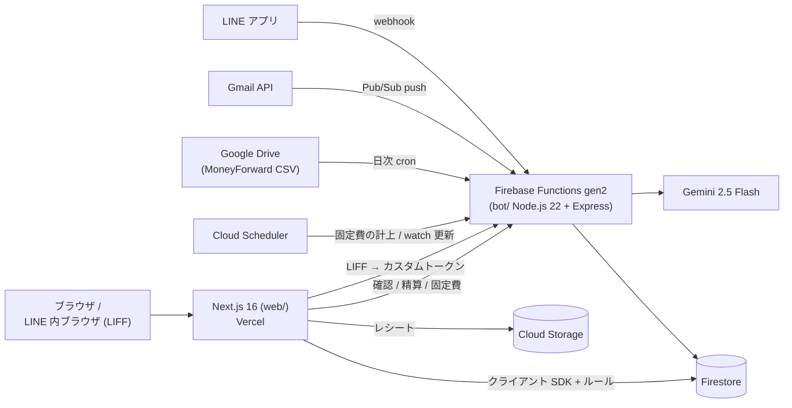

# 📱 LINE家計簿（ぶちこむ家計簿）

[](https://github.com/Makoto041/line-kakeibo/actions/workflows/ci-cd.yml)
[](LICENSE)

LINE にメッセージを送るだけで支出を記録できる、ふたり暮らし向けの家計簿アプリです。
`500 ランチ` のようなテキストを送ると Gemini がカテゴリを自動分類して登録し、クレジットカードの利用通知メールも自動で取り込みます。
Web では予算の進捗、支出の確認・編集、ふたりの精算、家賃・光熱費などの固定費を扱います。

> 📖 機能仕様は [docs/SPECIFICATION.md](docs/SPECIFICATION.md)、システム構成は [docs/ARCHITECTURE.md](docs/ARCHITECTURE.md)、
> セットアップは [docs/SETUP.md](docs/SETUP.md)、セキュリティの運用は [docs/SECURITY_OPERATIONS.md](docs/SECURITY_OPERATIONS.md) を参照。

## ✨ 主な機能

### 支出の入力

| チャネル | 内容 |
|---|---|
| 💬 **LINE テキスト入力** | `500 ランチ` のように送るだけで登録。確認カードから OK / 修正 / 立替 / 除外 / カテゴリ変更ができる |
| 📧 **Gmail 自動取込** | クレジットカード利用通知メールを Gmail API + Pub/Sub でリアルタイムに取り込む |
| 🔁 **固定費の自動計上** | 家賃・光熱費などを引き落とし日と見込み額で登録しておくと、毎月自動で支出に入る（Web の設定 → 固定費） |
| 📊 **MoneyForward CSV** | Google Drive 上の CSV を日次バッチで取り込む |
| ✏️ **Web** | 支出の確認・編集・削除、レシート画像の添付 |

### 集計と精算

- 🤖 **AI カテゴリ分類**: キーワード辞書 → キャッシュ → Gemini 2.5 Flash の 3 段で、コストを抑えつつ 19 カテゴリに分類
- 📈 **ホーム**: 月次の支出・予算の進捗・カテゴリ別・日別推移・前月比。要確認の支出があれば案内
- 🧾 **支出**: すべて / 要確認 / 立替 の絞り込み、検索、確認ボタン（LINE の OK と同じ処理）
- 🤝 **精算**: 期間の支出を折半して「誰が誰にいくら送金するか」を出す。未精算の立替の精算も同じ画面で記録
- 👫 **世帯**: メンバーは 2 名固定。LINE グループから退出すると Web のアクセス権も外れる
- 🛠️ **フィードバック起票**: LINE で「要望 〜」「不具合 〜」と送ると GitHub Issue を自動作成

> ⚠️ レシート画像の OCR は廃止済み。画像を送るとテキスト入力を案内します。

## 💬 LINE Bot の使い方

空白区切りで金額（必須）・日付・支払方法・内容を順不同に送ります。

```
500 ランチ
6/29 4800 家賃
1500 現金 ドラッグストア
```

| 入力 | 動作 |
|---|---|
| `家計簿` | 当月サマリーと Web へのリンク |
| `カテゴリー` / `カテゴリー <名前>` | カテゴリ一覧 / 既定カテゴリの設定 |
| `グループ作成 <名前>` / `グループ一覧` | 世帯（グループ）の作成・一覧。メンバー追加は管理者が `scripts/manage-group-members.mjs` で行う |
| `立替一覧` / `精算` | 未精算の立替の確認・精算 |
| `要望 <本文>` `不具合 <本文>` | GitHub Issue を自動起票 |

## 🏗️ アーキテクチャ


```mermaid
flowchart LR
    LINE["LINE アプリ"] -->|webhook| Bot["Firebase Functions gen2<br/>(bot/ Node.js 22 + Express)"]
    Gmail["Gmail API"] -->|Pub/Sub push| Bot
    Drive["Google Drive<br/>(MoneyForward CSV)"] -->|日次 cron| Bot
    Cron["Cloud Scheduler"] -->|固定費の計上 / watch 更新| Bot
    Bot --> Gemini["Gemini 2.5 Flash"]
    Bot --> FS[("Firestore")]
    Browser["ブラウザ /<br/>LINE 内ブラウザ (LIFF)"] --> Web["Next.js 16 (web/)<br/>Vercel"]
    Web -->|LIFF → カスタムトークン| Bot
    Web -->|クライアント SDK + ルール| FS
    Web -->|レシート| ST[("Cloud Storage")]
    Web -->|確認 / 精算 / 固定費| Bot
```

- **Bot（`bot/`）**: LINE webhook・Gmail 取込・スケジュール関数・Web 向け API（`/auth/line`、`/household/*`）を Firebase Functions gen2 でホスト
- **Web（`web/`）**: Vercel でホスト。読み取りはクライアント SDK から Firestore に直接（セキュリティルールで保護）、状態を変える操作は bot の API 経由
- 認証: LIFF の ID トークンを bot が検証し、`lineId` クレーム付きの Firebase カスタムトークンを発行。URL のパラメータは信用しない

## 🧰 技術スタック

| レイヤー | 技術 |
|---|---|
| Frontend | Next.js 16（App Router）+ React 19 + TypeScript + Tailwind CSS 4 + Recharts + framer-motion |
| Backend | Node.js 22 + TypeScript + Express 5 + `@line/bot-sdk` v11（Firebase Functions gen2） |
| Data | Firestore + Cloud Storage（ルールでアクセス制御） |
| AI | Gemini 2.5 Flash（カテゴリ分類・フィードバック解析） |
| 外部連携 | LINE Messaging API / LIFF / Gmail API + Pub/Sub / Google Drive API / GitHub API |
| Hosting / CI | Vercel（Web）+ Firebase（Bot・ルール）/ GitHub Actions |

## 📁 プロジェクト構成

```
line-kakeibo/
├─ bot/                  # Firebase Functions（LINE webhook / Gmail 取込 / API / スケジュール）
│  ├─ src/               # index.ts（webhook・API）, householdApi.ts, recurringExpenses.ts, line/, gmail/ など
│  └─ scripts/           # スモーク・エミュレータのテスト
├─ web/                  # Next.js（Vercel）
│  ├─ app/               # ホーム / expenses / settlement / settings / attach
│  ├─ components/        # 画面部品
│  ├─ lib/               # Firebase クライアント・hooks・ロジック（純関数）
│  └─ __tests__/         # node --test
├─ docs/                 # ARCHITECTURE / SPECIFICATION / SETUP / SECURITY_OPERATIONS / GMAIL_AUTO_SPEC
├─ scripts/              # 管理スクリプト（世帯メンバー・アイコン生成）
├─ test/                 # Firestore / Storage ルールのテスト
├─ firestore.rules / storage.rules / firestore.indexes.json
└─ .github/workflows/    # ci-cd.yml（ビルド・テスト・デプロイ）/ pr-checks.yml（ルールのテスト・依存の検査）
```

## 🚀 セットアップ

```bash
git clone https://github.com/Makoto041/line-kakeibo.git
cd line-kakeibo
npm install                       # npm workspaces
cp web/.env.example web/.env.local
cp bot/.env.example bot/.env      # 値を入れる（秘密値はコミットしない）
npm -w web run dev                # http://localhost:3000
npm -w bot run dev
```

外部サービス（LINE / Firebase / Gemini / Vercel）の設定と本番のシークレットの扱いは [docs/SETUP.md](docs/SETUP.md) を参照。

## 🔧 開発

- ブランチを切って PR を作り、CI（型チェック・lint・ビルド・テスト・ルールのテスト・CodeQL）が通ったら squash マージする。`master` への直接コミットはしない
- PR のタイトルは Conventional Commits（`feat:` / `fix:` / `refactor:` / `docs:` / `chore:`）。リリースノートに使う
- マージ後は自動でデプロイされる（Web は Vercel、Bot とルールは `ci-cd.yml`）

```bash
npm -w web test                 # web のロジックのテスト
npm -w bot test                 # bot のスモークテスト
npm -w bot run test:emulator    # API の統合テスト（エミュレータ）
```

## 🤝 コントリビュート

バグ報告・要望は [Issues](https://github.com/Makoto041/line-kakeibo/issues) へ。LINE Bot から「要望 〜」「不具合 〜」と送って起票することもできます。

## 📄 ライセンス

MIT License — 詳細は [LICENSE](LICENSE) を参照
