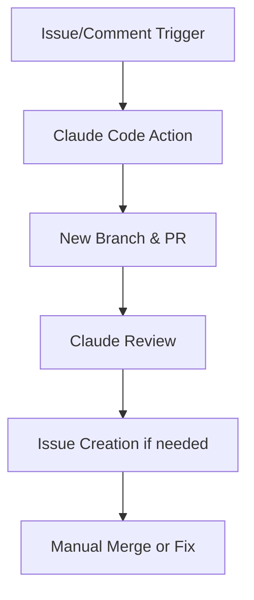

# 🤖 Claude Code Full Automation

このプロジェクトは Claude Code を用いた自動開発フローを導入しています。

## 🚀 機能概要

1. Issue やコメントを契機に Claude がコードを生成。
2. 自動でブランチを切り、コミット・PR を作成。
3. Claude が自動で PR をレビュー。
4. 問題点を検出すると自動で Issue を生成。

## ⚙️ 必要な設定

GitHub Secrets に以下を登録してください：

| Secret 名           | 用途                                         |
| ------------------- | -------------------------------------------- |
| `ANTHROPIC_API_KEY` | Claude Code API キー                         |
| `GITHUB_TOKEN`      | Actions が PR/Issue を操作するためのトークン |

> Claude Code は Anthropic のサブスクリプション版を使用します。  
> [Anthropic Console](https://console.anthropic.com/) でキーを取得できます。

## 💬 トリガー方法

- 手動実行：Actions から「Claude Code Full Automation」を選択して Run
- コメントトリガー：Issue や PR に `@claude 実装して` と書くと自動起動

## 🧩 ワークフロー概要

