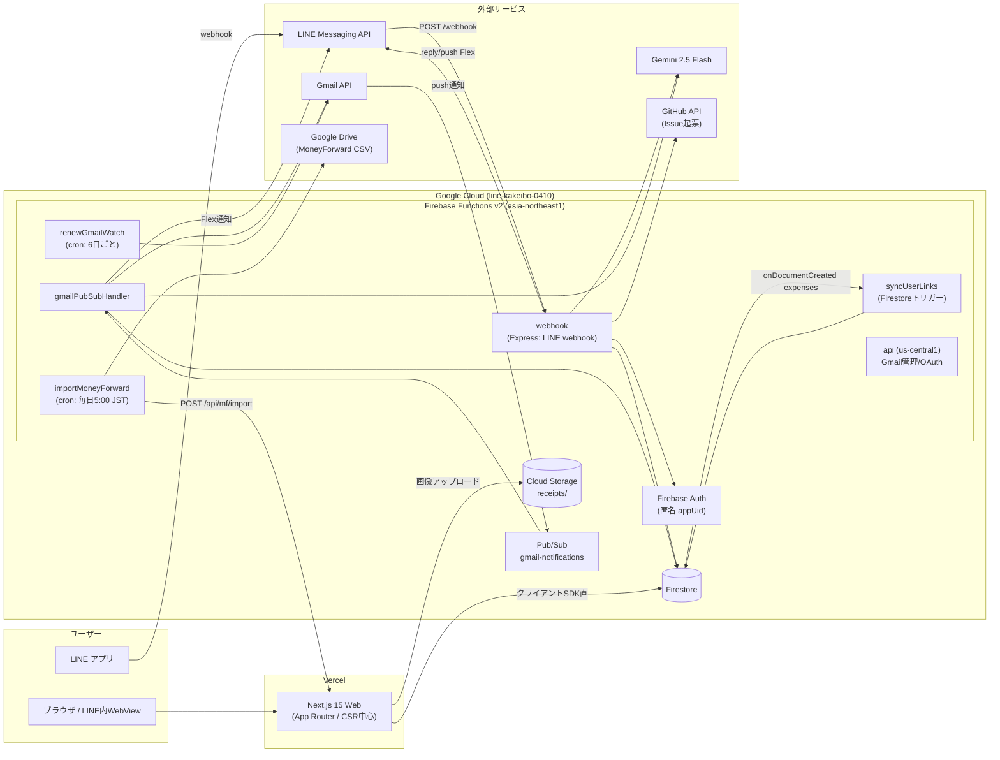

# LINE家計簿 アーキテクチャ概要

最終更新: 2026-07-01（コードベース実装準拠）

機能仕様は [SPECIFICATION.md](./SPECIFICATION.md) を参照。

---

## 1. システム全体像



## 2. コンポーネント構成

| コンポーネント | 技術 | ホスティング | 役割 |
|---|---|---|---|
| `bot/` | Node.js 20 + TypeScript + Express 5 + `@line/bot-sdk` v10 | Firebase Functions v2（`firebase.json` の `functions.source: "bot"`、region `asia-northeast1`） | LINE webhook、Gmail 取込、cron バッチ、Firestore トリガー |
| `web/` | Next.js 15（App Router）+ React 19 + TypeScript + Tailwind + Recharts + framer-motion | Vercel（`web/vercel.json`） | ダッシュボード・支出管理 UI。**サーバー API はほぼ持たず**クライアントから Firestore/Storage 直アクセス |
| `types/` | TypeScript | − | 共通型（※一部 web/bot と乖離あり） |
| Firestore | − | GCP | 唯一の永続データストア。ルール/インデックスはリポジトリ管理（`firestore.rules` / `firestore.indexes.json`） |
| Cloud Storage | − | GCP | レシート画像（`receipts/{expenseId}/`） |

### デプロイ単位が Vercel と Firebase に分かれている点に注意

- Web → Vercel（Git 連携 auto-deploy: `main`/`master`/`develop`）
- Bot・Firestore ルール/インデックス・Storage ルール → `firebase deploy`
- Flex メッセージのアイコン PNG は **Vercel（web/public/icons）から配信**され Bot が参照する、というクロス依存がある

## 3. Cloud Functions 一覧

| Function | トリガー | リージョン | 役割 |
|---|---|---|---|
| `webhook` | HTTPS（Express） | asia-northeast1 | LINE webhook 本体。`/health` `/classification-stats` `/test-classification` も同居 |
| `gmailPubSubHandler` | Pub/Sub `gmail-notifications` | asia-northeast1 | SMBC カード利用メールの取込 |
| `renewGmailWatch` | cron `0 3 */6 * *` JST | asia-northeast1 | Gmail watch（7日失効）の更新 |
| `importMoneyForward` | cron `0 5 * * *` JST | asia-northeast1 | Drive の MoneyForward CSV 取込 |
| `syncUserLinks` | Firestore `expenses/{id}` onCreate | asia-northeast1 | `userLinks/{appUid}.lineIds[]` へ lineId を追記 |
| `api` | HTTPS（Express） | **us-central1** | Gmail OAuth / watch 管理エンドポイント（`ADMIN_SECRET` 認証） |

## 4. 主要データフロー

### 4.1 テキスト支出登録

```text
LINEテキスト → webhook(署名検証)
  → parseTextExpense()（金額必須・日付/支払方法/カテゴリ/摘要を抽出）
  → 並列: プロフィール取得(15分cache) / appUid解決(匿名Auth) / カテゴリ分類
  → カテゴリ分類: キーワードマップ → キャッシュ → Gemini 2.5 Flash（確信度≥0.4で採用）
  → expenses 保存 (confirmed:false, includeInTotal:false, inputSource:'line_text')
  → 確認Flex返信（現在の設定3行＋[変更] / OK / 修正 / レシート添付 / 家計簿一覧を見る）
  → postbackで status / includeInTotal / category を確定 → 最新値のカードを返信
```

### 4.2 Gmail カード利用自動取込

```text
SMBC利用通知メール → Gmail push → Pub/Sub → gmailPubSubHandler
  → history API差分取得 → SMBCフィルタ → 利用先/金額/利用日時パース
  → Gemini分類 → Firestoreトランザクションでアトミック保存
     （gmailMessageId ＋ date+amount+usedAt±1分 の二重チェックで重複排除）
  → LINEグループへFlex通知（テキスト入力と同じ登録・編集カード）
```

### 4.3 Web 閲覧・編集

```text
LINEのリンク(?lineId=xxx) → Next.js（クライアント）
  → useLineAuth: URLパラメータで識別（ログインなし）
  → useExpenses: 個人分(where lineId==) ＋ 関与した全lineGroupIdのグループ分をマージ
  → メモリSWRキャッシュ＋framer-motionでSPA風遷移
  → 編集/削除/レシート添付はクライアントSDKでFirestore/Storageへ直書き
```

### 4.4 立替・精算（グループ）

- 支出を `status: 'advance_pending'` + `advanceBy` でマーク
- `立替一覧` コマンドで未精算集計と精算額計算、`精算` で `advance_settled` へ一括更新
- Web の支出一覧では支払者（`payerId`/`payerDisplayName`）別集計を表示

## 5. カテゴリ分類パイプライン（コスト最適化）

```text
入力テキスト
  ├─ 1. FAST_KEYWORD_MAP（メモリ内・即時・conf 0.8）── ヒット→終了
  ├─ 2. 結果キャッシュ（15分TTL）／ユーザー別キャッシュ（30分TTL）── ヒット→終了
  └─ 3. Gemini gemini-2.5-flash（few-shot JSON・8sタイムアウト）
        └─ 出力を categoryNormalization で正準19カテゴリに正規化
```

その他のコスト施策:

- **replyMessage 優先・push フォールバック**（LINE 無料枠 200 push/月の節約。※対象はテキスト支出の登録通知経路。Gmail カード通知・postback 応答・カテゴリカルーセルは push 専用）
- LINE プロフィール 15 分メモリキャッシュ、`Promise.allSettled` による並列化
- レシート画像はアップロード前にクライアントで圧縮（Vision API 依存は撤廃済み＝OCR 廃止）
- Function ごとのメモリチューニング（webhook 512MiB / Gmail 系 256MiB）

## 6. 認証・セキュリティモデル

**現状は「URL パラメータ認証」であり、DB 層の防御はほぼ無い。**

| レイヤ | 現状 |
|---|---|
| LINE webhook | チャネルシークレットによる署名検証 ✅ |
| Web ユーザー識別 | `?lineId=` クエリのみ。LIFF / Firebase Auth ログイン未使用 ⚠️ |
| Firestore ルール | `userLinks` のみ `request.auth.uid == uid`。**他コレクションは `if true`** ⚠️ |
| Storage ルール | 読取は公開、書込は `image/*` かつ 10MB 未満 ⚠️ |
| Gmail 管理 API | `ADMIN_SECRET`（`X-Admin-Secret` / `Authorization: Bearer` ヘッダーに加え **`?adminSecret=` クエリでも受理** — ログ等への露出リスクあり）＋ レートリミット、OAuth callback は CSRF state ⚠️ |
| Gmail スコープ | `gmail.readonly` に最小化 ✅ |

### 改善ロードマップ（推奨）

1. Web に **LIFF ログイン**（または Firebase Auth カスタムトークン）を導入し、`lineId` を ID トークンから取得
2. `firestore.rules` を `appUid` / グループメンバーシップベースに強化（`web/firestore-security-rules-update.md` に草案あり）
3. `userLinks` の 1:1 / 1:N 二重管理を統一
4. Storage の読取を署名付き URL 化

## 7. デプロイ・CI/CD

- **ブランチ運用**: `feature/* → develop → master`（`DEPLOYMENT_SETUP.md`）。develop = Vercel プレビュー、master = 本番
- **GitHub Actions**: `deploy-develop.yml` / `deploy-production.yml` / `pr-checks.yml`。Secrets: `FIREBASE_SERVICE_ACCOUNT_*`, `FIREBASE_TOKEN`, `VERCEL_TOKEN`, `VERCEL_ORG_ID`, `VERCEL_PROJECT_ID`
- **手動スクリプト**: `web/deploy-vercel.sh`（lint→build→vercel --prod）、`deploy-bot.sh`（firebase deploy --only functions）、`deploy-all.sh`
- ローカル開発: `web` は `npm run dev`（:3000）、`bot` は `ts-node-dev`（:8080）＋ Firebase Emulator（`NEXT_PUBLIC_USE_FIREBASE_EMULATOR`）

## 8. ディレクトリ構成（現行）

```text
line-kakeibo/
├─ bot/                      # Firebase Functions v2 (Node 20)
│  └─ src/
│     ├─ index.ts            # Express webhook・全コマンドルーティング・Functionエクスポート
│     ├─ textParser.ts       # 支出テキストパーサ
│     ├─ firestore.ts        # Firestoreデータアクセス（支出/グループ/予算/精算）
│     ├─ geminiCategoryClassifier.ts / categoryNormalization.ts
│     ├─ linkUserResolver.ts / userLinks.ts / syncUserLinks.ts
│     ├─ issueCreator.ts     # フィードバック→GitHub Issue
│     ├─ importMoneyForward.ts
│     ├─ line/               # flexMessage.ts / postback.ts
│     └─ gmail/              # auth.ts / watch.ts / parser.ts / handler.ts / types.ts
├─ web/                      # Next.js 15 (Vercel)
│  ├─ app/                   # / , /expenses , /settings , /attach , /link , /debug ほか
│  ├─ components/            # AppShell, Charts, theme ほか
│  └─ lib/                   # firebase.ts, hooks.ts, swrCache.ts, categoryNormalization.ts ほか
├─ types/shared.ts           # 共通型（※一部乖離あり）
├─ firestore.rules / firestore.indexes.json / storage.rules
├─ firebase.json / .firebaserc / vercel.json
└─ docs/                     # 本ドキュメント
```
